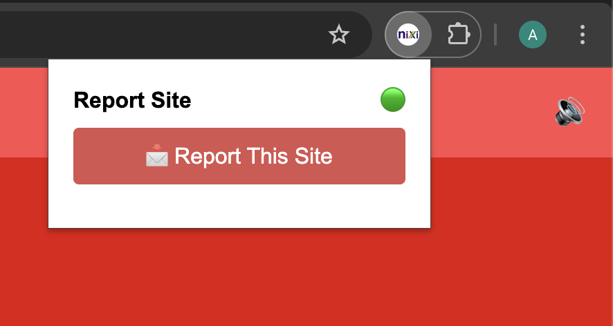
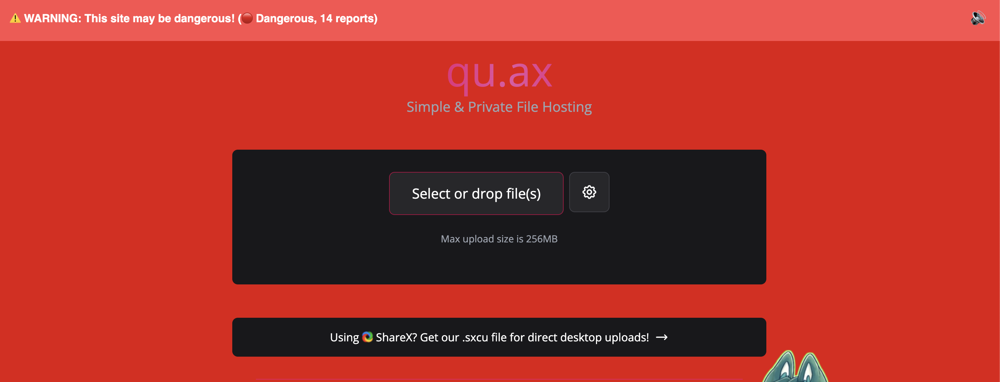

# 🚨 Suspicious Site Warning – Chrome Extension  

A **Chrome Extension** that protects users from malicious or suspicious websites.  
It combines **Google Safe Browsing API**, a **community-powered reporting system**, and **fraud analysis logic** to make browsing safer and more transparent.  

---

## ✨ Features  

### 🔒 Real-time Safe Browsing Check  
✔️ Detects phishing, malware, and harmful websites using **Google Safe Browsing API**.  

### 📝 Community Reporting  
✔️ Users can **report suspicious domains** → stored in **Google Sheets / SQL DB** for further analysis.  

### 📊 Severity Levels  
- 🟢 **Low Risk** → Less than 2 reports  
- 🟠 **Suspicious** → 2–5 reports  
- 🔴 **Dangerous** → More than 5 reports (**full-page red overlay warning**)  

### 🗣️ Multilingual Warnings  
✔️ Shows warning banners in **multiple Indian & global languages** (English, Hindi, Bengali, Tamil, Gujarati, Kannada, etc.)  
✔️ **Text-to-Speech support** for accessibility.  

### 📌 Popup Dashboard  
- 📩 **One-click site reporting**  
- 📈 **Live report counts**  
- 🚨 **Site severity level** (Low, Suspicious, Dangerous)  

### 📂 Database Integration  
✔️ **Live sync** between **MySQL → Google Sheets → Extension**  
✔️ Enables HR/management to **monitor malicious domains in real time**.  

---

## 🎥 Demo Video  
📌 [🔗 Add your demo video link here once uploaded]  

---

## 📸 Screenshots  

| Popup | Warning Banner |
|-------|----------------|
|  |  |  

---

## ⚙️ Installation (Developer Mode)  

1. Clone this repository:  
   ```bash
   git clone https://github.com/yourusername/suspicious-site-warning-extension.git
Open Chrome → go to chrome://extensions/

Enable Developer Mode (top-right)

Click Load Unpacked → Select the project folder

✅ Extension will appear in your browser!

🛠️ Tech Stack
Frontend → JavaScript, HTML, CSS

Backend → Google Apps Script + Google Sheets

Database → MySQL (fraud domains, live sync with Sheets)

API → Google Safe Browsing API

🚀 Future Improvements
🤖 AI/ML model to detect lookalike domains (e.g., g00gle.com vs google.com)

📊 Centralized fraud intelligence dashboard for enterprises

📡 Integration with CEIR/telecom fraud databases

📨 Export suspicious reports to CERT-In / cybercrime portals

👨‍💻 Author
Aayush Singh
💼 www.linkedin.com/in/aayush1908
📧 code.aayush.19@gmail.com

⭐ If you like this project, give it a star on GitHub! ⭐